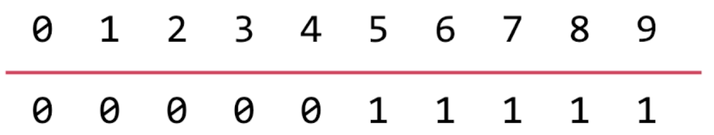

# 并查集

## 一.什么是并查集


1.并查集是一种树型的数据结构，用于处理一些不相交集合（Disjoint Sets）的合并及查询问题。常常在使用中以森林来表示。

  在一些有N个元素的集合应用问题中，我们通常是在开始时让每个元素构成一个单元素的集合，然后按一定顺序将属于同一组的元素所在的集合合并，其间要反复查找一个元素在哪个集合中。这一类问题其特点是看似并不复杂，但数据量极大，若用正常的数据结构来描述的话，往往在空间上过大，计算机无法承受；即使在空间上勉强通过，运行的时间复杂度也极高。
  

2.并查集可以高效的解决网络中两点之间的连接问题;
  
  这里说的网络是一个抽象的概念，比如说用户的关系网 地铁站点等都可以叫做网络。
  

3.并查集支持的主要动作：

  **union(p, q)：合并给定的两个参数;
  
  **isConnected(p, q)：查询连个参数是否在同一集合;
  
  **find(p)：查询参数所在的集合（根）

  
  
4.并查集接口设计:
  ```java
  package com.ylvis.UnionFind;

  public interface UF {
      int getSize();

      boolean isConnected(int p, int q);

      void unionElements(int p, int q);

      int find(int p);
  }
  ```

## 二.QuickUnion

并查集基本数据表示:

